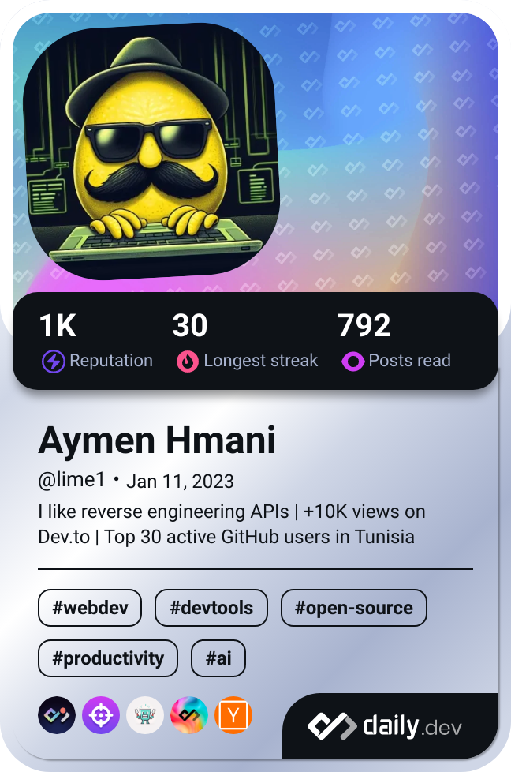

<h1 align="center">Hi 👋, im Aymen Hmani</h1>
<h3 align="center">A Computer Engineering Student at ESPRIT</h3>

   
 

## 🔭 Skills

- Python
- Linux
- Server infrastructure
- Automation
- APIs
- Networking
- Prompt engineering

## 🌐 Socials

 

## 📰 Latest Blog posts
<!-- BLOG-POST-LIST:START -->
- [My &quot;solution&quot; to integrate ChatGPT into any database](https://dev.to/thelime1/my-solution-to-integrate-chatgpt-into-any-database-8lb)
- [Building an Infinite Website with Flask and OpenAI&#39;s davinci-v3](https://dev.to/thelime1/building-an-infinite-website-with-flask-and-openais-davinci-v3-23ja)
- [How I gained $2,000 in 3 weeks using custom-built CS:GO trading bot](https://dev.to/thelime1/how-i-gained-2k-in-3-weeks-using-custom-built-csgo-trading-bot-3j8g)
- [Make a Self-Replicating Virus in C](https://dev.to/thelime1/make-a-self-replicating-virus-in-c-15b6)
<!-- BLOG-POST-LIST:END -->

## 📚 Stack

 

## 🛠️ Frameworks

More

